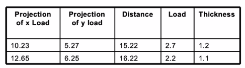
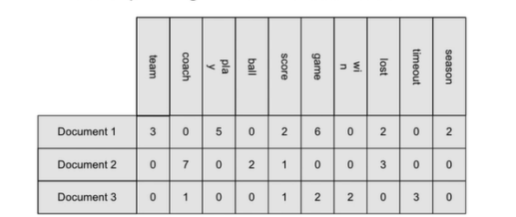
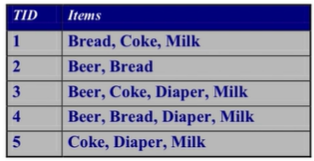
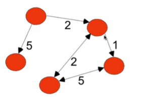
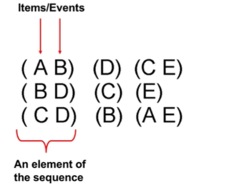

# Data Sets

- Record
  - Data that consists of a collection of records, each of which contains a fixed set of attributes.
  - **Ex**: Data Matrix
    - If data objects have the same field set of numeric attributes, then the data objects can be thought of as points in a multi-dimensional space, where each dimension represents a distinct attribute
    - M x N matrix with M rows, one for each object, and N columns, one for each attribute.
    - 
  - **Ex**: Document Data
    - Vector representation of the document
    - Each document becomes a 'term' vector
    - Each term is a component of the vector, the value of the component is the number of times that term occurs in the document.
    - 
  - **Ex**: Transaction data
    - Each record (transaction) involves a set of items
    - The set of products purchased by a customer during one shopping trip composes a transaction, while the individual products are the items.
    - 
- Graph
  - 
  - World Wide Web
  - Molecular Structures
- Ordered
  - Sequences of transactions
    - 
  - Spatial data
  - Temporal data
    - Monthly average temperature
  - Sequential data
  - Genetic sequence data

## Important Characteristics of Structured Data

- Dimensionality
  - Too many fields - curse of dimensionality
- Sparsity
  - Some data where lots of cells are Zero
  - Dataset should be structured to only include non-zero
    - Reduces memory
  - Only presence counts
- Resolution
  - Granularity/detail level of the data
    - Too detailed = too much noise
    - Not detailed enough = no pattern can be determined
  - Patterns depend on the scale

## Quality of Data

- Examples of problems:
  - Noise
    - Collection of data is unable to produce exact values
  - Outliers
    - Data that is entirely different than other objects in the data set
  - Missing values
    - information not collected
    - Attributes may not be applicable to all cases
    - Handling missing values:
      - Eliminate data objects
      - Estimate missing values
      - Ignore the missing value during analysis
      - Replace with all possible values (weighted by their probability)
  - Duplicate data
    - Merging data from heterogenous sources
