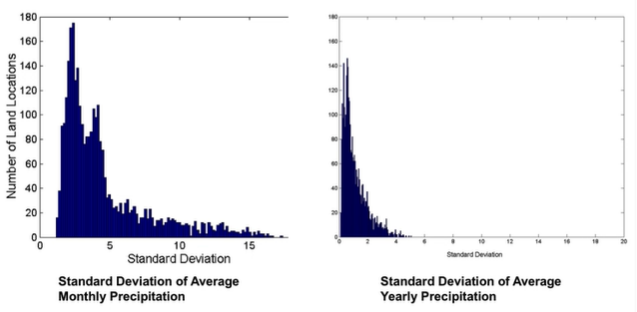
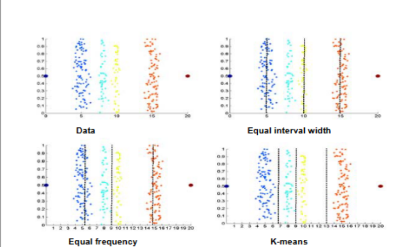

# Data Preprocessing

## Aggregation

- The way data is grouped to get the correct level of detail for optimal analysis
- Combining two of more attributes into a single attribute
- Purpose:
  - Data reduction
    - Reduce the number of attributes or objects
  - Change of scale
    - Cities aggregated into regions, states, countries, etc
  - More "stable" data
    - Aggregated data trends to have less variability
  - 

## Sampling

- Main technique employed for data selection
  - Often used in both preliminary investigation as well as final data selection
- Obtaining an entire set of data is too expensive (computational/monetarily) or time consuming
- Difficulty is trying to get a true representative sample
  - We want a sample as close as possible to the same characteristics of the original dataset.
- Types of sampling
  - Simple Random Sampling
    - There is an equal probability of selecting any particular item
  - Sampling without replacing
    - As each item is selected, it is removed from the population
  - Sampling with replacement
    - Objects are not removed
    - Same object can be selected multiple times
  - Stratified sampling
    - Split the data into several partitions
    - draw random samples from each partition

## Dimensionality Reduction
  
- When dimensionality increases, data becomes increasingly sparse in the space that it occupies
- Definitions of density and distance between points become less meaningful
- **Purpose**:
  - Avoid above concerns
  - Reduce amount of time and memory required by data mining algorithms
  - Allow data to be more easily visualized
  - May help eliminate irrelevant features of reduce noise
- **Techniques**:
  - Principle Component analysis
  - Singular Value Decomposition
  - Supervised and Non-linear techniques
- **Goal**:
  - Find a projection of the data
  - That projection should capture the largest amount of variation in data.

## Feature subset selection

- Different way to reduce dimensionality of data
- Redundant features
  - Duplicate much of all of the information contained in one of more other attributes
    - **Ex**: Purchase price of a product and the amount of sales tax paid
- Irrelevant features
  - Containing no information that is useful for data mining task
    - **Ex**: Student ID and eye color are irrelevant for predicting students' GPA
- **Techniques**:
  - Brute-force approach
    - Try all possible feature subsets as input to data mining algorithm
    - Practical for smaller data sets
  - Embedded approaches
    - Feature selection occurs naturally as part of the data mining algorithm
  - Filter approaches
    - Features are selected before data mining algorithm is run
  - Wrapper approaches
    - Use the data mining algorithm as a black box to find the best subset of attributes

## Feature creation

- Create new attributes that can capture the important information in a data set much more efficiently than the original attributes
- **Techniques**:
  - Feature Extraction
    - Domain specific
  - Mapping data to new space
  - Feature construction
    - Combining features

## Discretization or Binarization

- Simplify the quantification of values
- Transform continuous values to discrete
- 
- Equal Interval Width
  - Split in which a way that size of intervals are of same length
- Equal Frequency
  - Split group of data points so roughly same number of points in each one
- K-means
  - Initial guess for each groups mean
  - through an iterative process, adjust means to find the most optimal splits

## Attribute Transformation

- Convert between measurements
