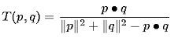
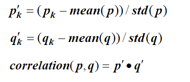
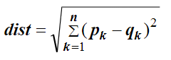
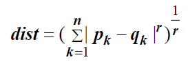
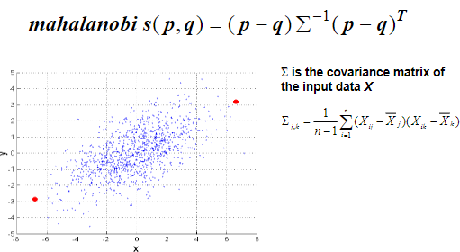
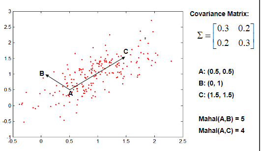

# Similarity and Distance

## Similarity and Dissimilarity

- Similarity
  - Numerical measure of how alike two data objects are.
  - Is higher when objects are more alike.
  - Often falls in the range [0,1]
- Dissimilarity
  - Numerical measure of how different are two data objects
  - Lower when objects are more alike
  - Minimum dissimilarity is often 0
  - Upper limit varies
- Proximity refers to a similarity or dissimilarity

### Types
  
- Simple Matching and Jaccard Coefficients
  - SMC = number of matches / number of attributes
    - (M11 + M00) / (M01 + M10 + M11 + M00)
  - J = number of 11 matches / number of not-both-zero attributes values
    - (M11) / (M01 + M10 + M11)
- Cosine
  - If d1 and d2 are two document vectors, then
  - cos( d1, d2 ) = (d1 * d2) / ||d1|| ||d2||,
  - where * indicates vector dot product and ||d|| is the length of vector d.
- Extended Jaccard Coefficient (Tanimoto)
  - Variation of Jaccard for continuous or count attributes
  - Reduces to Jaccard for binary attributes
  - 
- Correlation
  - Correlation measures the linear relationship between objects
  - To compute correlation, we standardize data objects, p and q, and then take their dot product
  - 

## Distance

- Euclidean Distance
  - 
  - Where n is the number of dimensions (attributes) and pk and qk are, respectively, the kth attributes (components) or data objects p and q.
  - Standardization is necessary, if scales differ
- Minkowski Distance
  - 
  - Where r is a parameter, n is the number of dimensions (attributes) and pk and qk are, respectively, the kth attributes (components) or data objects p and q
- Mahalanobis Distance
  - 
  - 