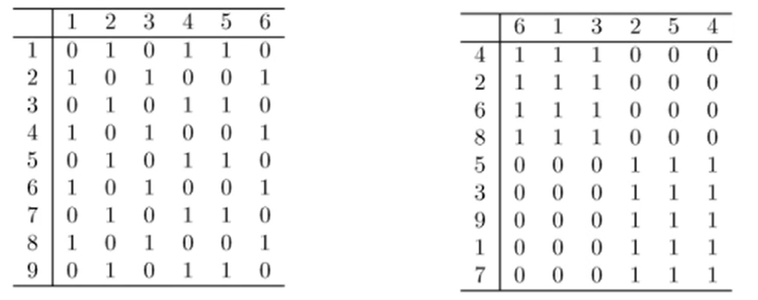

# Visualization

The conversion of data into a visual or tabular format so that the characteristics of the data and the relationships amongst the data items can be analyzed or reported

## Representation

- Is the mapping of information to a visual format
- Data objects, their attributes adn the relationships among data objects are translated into graphical elements such as points, lines, shapes and colors

## Arrangement

- Is the placement of visual elements within a display
- can make a large difference in how easy it is to understand the data
- Patterns visually immerge depending on its arrangement
- 

## Selection

- is the elimination or the de-emphasis of certain objects of attributes
- Selection may involve the choosing a subset of attributes
  - Dimensionality reduction is often used to reduce the number of dimensions to two or three
  - Alternatively, pairs of attributes can be considered
- Selection may also involve choosing a subset of objects
  - A region of the screen can only show so many points
  - Can use sampling, but we want to preserve points in sparse areas
