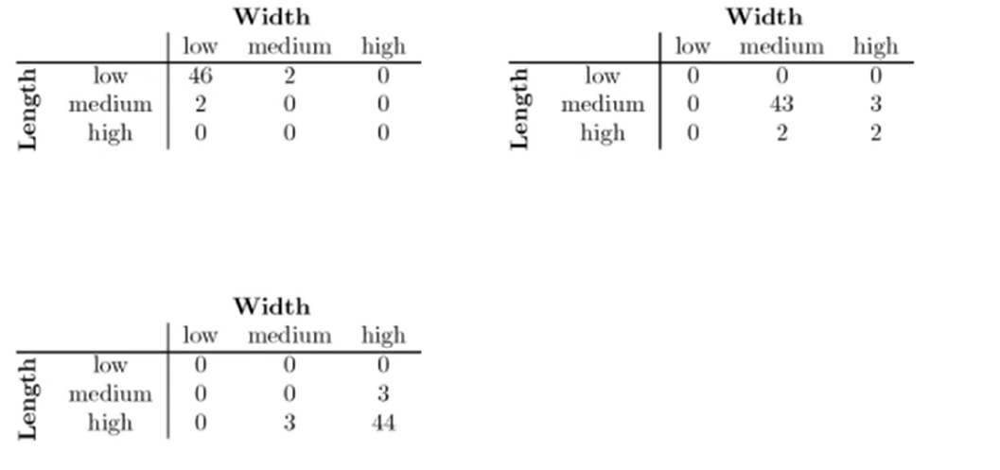

# On-Line Analytical Processing (OLAP)

- Relational databases put data into tables, while OLAP uses a multidimensional array representation
  - Such representations of data previously existed in statistics and other fields
- There are a number of data analysis and data exploration operations that are easier with such a data representation
- **Strategy**:
  - Start with a fact table
  - De-normalize so that slicing/dicing/aggregation is easier
- **Steps**:
  - Identify which attributes are to be the dimensions and which should be the target attributes (the ones that appear as entries)
    - Attributes used as dimensions must have discrete values
    - Target value is typically a count of continuous value
    - Our target variable is simply the count of objects that have th same set of attribute values.
  - Find a value of each entry in the multidimensional array by summing the values or count of all objects that have the attribute values corresponding to that entry
- **Example**:
  - Iris data - show all attributes can be converted to a multidimensional array
  - We discretize the petal width and length to have categorical values (low medium high)
    - 
  - Each unique tuple of petal width, length and species identifies one element of the array
    - 
  - Slices of the array are shown in cross-tabulations
    - 