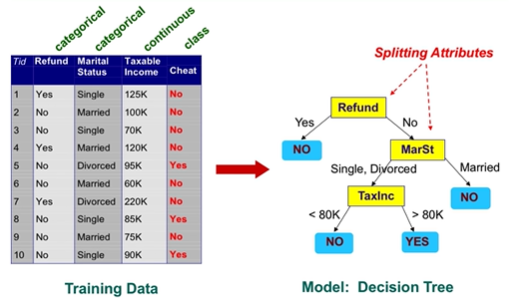
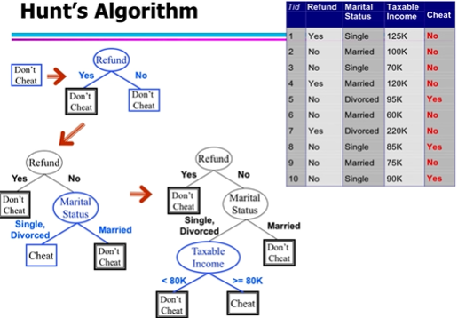
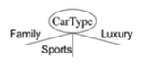
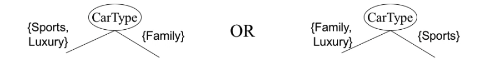
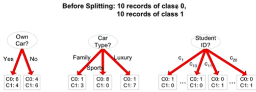
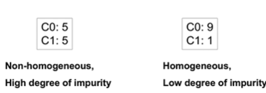

# Classification

## Task

- Given a collection of records (training set)
  - Each record contains a set of attributes, and one of them is te class
- Find a model for class attributes as a function of the values of other attributes
  - A test set is usually used to determine the accuracy of the model

## Techniques

- Logistic regression
- Linear discriminant analysis
- Neural networks
- Naive bayes and bayesian belief networks
- Support vector machines
- Rule-based methods
- Decision trees
  
### Decision trees

- 
  - One of many different decision trees
- **How to generate**: **Hunt's algorithm**
  - 
  - Let Dt be the set of training records tht teach a node t
    - If Dt contains records that belong to the same class Yt, then t is a leaf node labeled as Yt
    - If Dt is an empty set, then t is a leaf node labeled by the default class Yd
    - If Dt contains records that belong to more than one class, use an attribute test to split the data into smaller subsets
    - Recursively apply this procedure until complete.
- **Splitting for ordinal attributes**:
  - Multi way split:
    - Use as many partitions as distinct values
    - 
  - Binary split:
    - Divides values into two subsets. Need to find optimal partitioning.
    - 
- **Splitting for continuous attributes**:
  - Discretization:
    - To form an ordinal categorical attribute
    - Static - discretize once at the beginning
    - Dynamic - Ranges can be found by equal interval bucketing, equal frequency bucketing (percentiles), or clustering
  - Binary Decision: (A < v) or (A >= v)
    - Consider all splits to find the best cut
    - Can be more computationally intensive
- How to determine best split
  - 
  - Greedy approach:
    - Nodes with homogeneous class distribution are preferred
    - Need a measure of node purity
    - 
