# Measures of Impurity

## Gini Coefficient

- Looking to minimize the coefficient.
- 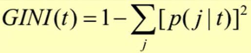
  - p(j | t) is the relative frequency of class j at node t
- Maximum (1 - 1/nc) where nc is the number of classes
  - when records are equally distributes among all classes 
  - implying least interesting information
- Minimum (0.0)
  - when all records belong to one class
  - implying most interesting information
- 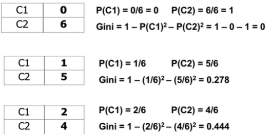

### Splitting based on gini

- Used in CART, SLIQ, SPRINT
- When a note p is split into k partitons (children), the quality of the split is computed as:
  - 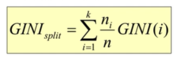
  - where ni = number of records at child i
  - n = number of records at node p 
- 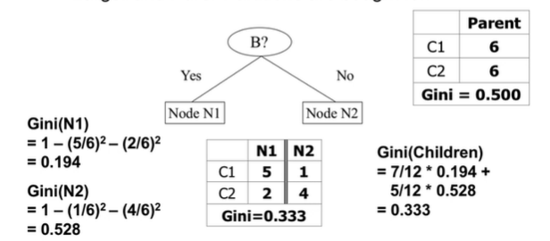
  - Splits into two partitions
  - Effect of weighting these partitions is that larger and purer partitions are sought for

### Categorical Attributes - computing gini index

- For each distinct value, gather counts for each class in the data set
- Use the count matrix to make decisions

### Continuous Attributes - computing gini index

- Use binary decisions based on one value
- Several choices for the spiting value
  - Number of possible splitting values = number of distinct values
- Each splitting value has a count matrix associated with it
  - Class counts in each of the partitions, A < v and A >= v
- Simple method to choose best v:
  - For each v, scan the database to gather count matrix and computer the Gini index
  - Computationally inefficient
  - 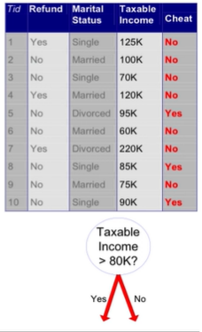
- Better method:
  - For each attribute:
    - Sort the attribute on values
    - Linearly scan these values, each time updating the count matrix and computing the gini index
    - Choose the split position that has the least gini index
    - 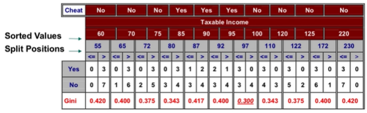

## Entropy

- Measure of the amount of data required to provide valid information
  - Measures the homogeneity of a node
- 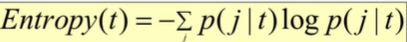
  - p(j | t) is the relative frequency of class j at node t
- Maximum (log nc) where nc is the number of classes
  - when records are equally distributes among all classes 
  - implying least information
- Minimum (0.0)
  - when all records belong to one class
  - implying most information
- 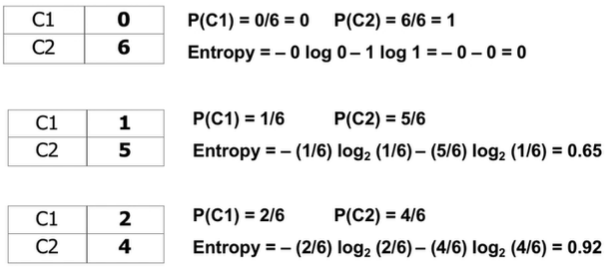
  - The second equation should have 5/6 in the second log
  - Notice the huge drop off between 0/6 to 1/5

### Splitting based on info

- 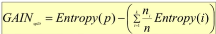
  - Parent node p is split into k partitions
  - ni is the number of records in partition i
  - Purity measure of parent - purity measure of the child
- Measured reduction in entropy achieved because of the split
- Choose the split that achieves most reduction (maximizes gain)
- Used in ID3 and C4.5
- Disadvantage: Tends to prefer splits that results in large numbers of partitions, each being small but pure.
- Gain Ratio
  - 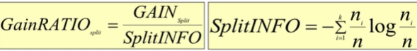
  - Adjusts information gain by the entropy of the partitioning. 
  - This solves disadvantage above, causing higher entropy partitioning to be penalized.
  - used in C4.5
  - Designed to overcome the disadvantage of information gain

## Misclassification error

- 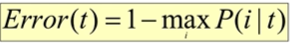
  - Maximum (1-1/nc) when records are equally distributed among all classes
  - Minimum (0.0) when records belong to one class
- 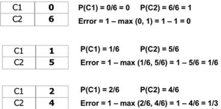
