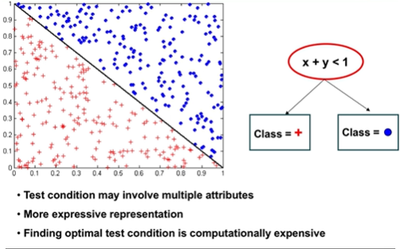

# Error

## Estimating Generalization Errors

- **Re-substitution errors**: error on training (sigma e(t))
- **Generalization errors**: error on testing (sigma e'(t))
- Methods for estimating generalization errors:
  - Optimistic approach: e'(t) = e(t)
  - Pessimistic approach:
    - for each leaf node: e'(t) = e(t)
    - total errors: e'(T) = e(T) + N x 0.5 (N: number of leaf nodes)
    - EX: For a tree with 30 leaf nodes and 10 errors in training (out of 1000)
      - Training error = 10/1000 = 1%
      - Generalization error = (10 + 30 x 0.5)/1000 = 2.5%

## Occam's Razor

- Easiest explanation is the best one
- Model with the fewest assumptions is usually the best one to use

## Minimum Description Length (MDL)

- Cost(Model,Data) = Cost(Data|Model) + Cost(Model)
  - Cost is number of bits needed for encoding
  - Search for the least costly method
- Cost(Data|Model) encodes the misclassification errors.
- Cost(model) uses node encoding (number of children) plus splitting condition encoding.

## Overfitting & Overfilling

- Generally results in decision trees that are more complex than necessary
- Training error no longer provides a good estimate of how well the tree will perform
- Need new was for estimating errors
- 
- Overfitting due to Noise
  - 
- Overfitting due to insufficient examples
  - 
  - Lack of data points in the lower half of the diagram makes it difficult to predict correctly the class labels of that region

### Address overfilling

- **Pre-pruning (Early stopping rule)**
  - Stop the algorithm before it becomes a fully grown tree
  - Typical stopping conditions for a node:
    - Stop if all instances belong to the same class
    - Stop if all the attribute values are the same
  - More restrictive conditions
    - Stop if number of instances is less than some user-specified threshold
    - Stop if class distribution of instances are independent of the available features
    - Stop if expanding the current node does not improve impurity measures
- **Post-pruning**:
  - Grow decision tree to its entirety
  - Trim the nodes of the decision tree in a bottom-up fashion
  - if generalization error improves ate trimming, replace sub-tree by a leaf node
  - If generalization error improves after trimming, replace sub-tree by a leaf node
  - Class label of leaf node is determines from majority lca ss of instances in the sub-tree
  - Can use MDL for post-pruning
  - 

## Handling missing attribute values

- Missing values affect decision tree construction:
  - How impurity measures are computed
  - How to distribute instance with missing value to child node
  - How to test instance with missing value is classified

### Distribute instances

- 
- 
- For the known values, split as shown:
  - 
- Then, do a proportional addition of the unknown attribute
  - 

### Classify instances

- 

## Other issues w/decision trees

- Data fragmentation
  - Number of instances get smaller as you traverse down the tree
  - Number of instances at the leaf nodes could be too small to make any statistically significant decision
- Search strategy
  - Finding an optimal decision tree is NP-hard
  - The algorithm presented so far uses a greedy, top-down, recursive partition
  - Other strategies: Bottom-up/Bi-directional
- Expressiveness
  - DEcision tree provides expressive representation for learning discrete-valued function
    - But they do not generalize well to certain types of boolean functions
    - ex: parity function
      - Class = 1 if there is an even number of attributes with true value.
      - Class = 0 if there is an odd number of attributes with true value
      - For accurate modeling, must have a complete tree
  - Not expressive enough for modeling continuous variables
- Tree replication
  - Same subtree appears in multiple branches
    - 
- Decision boundary:
  - 
  - 
