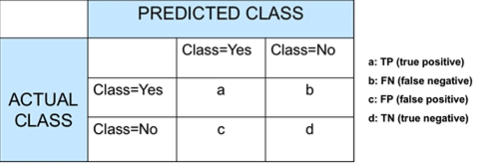
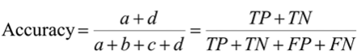
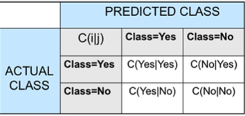
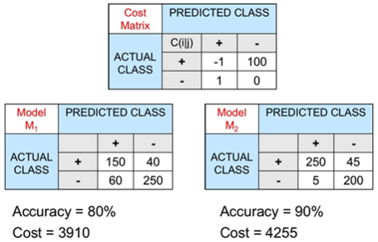
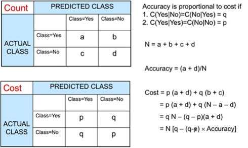
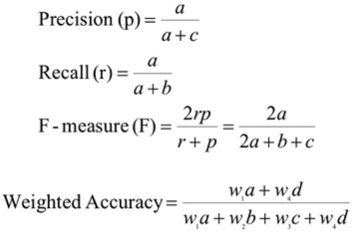
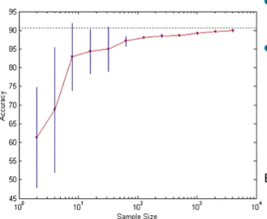
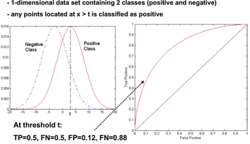
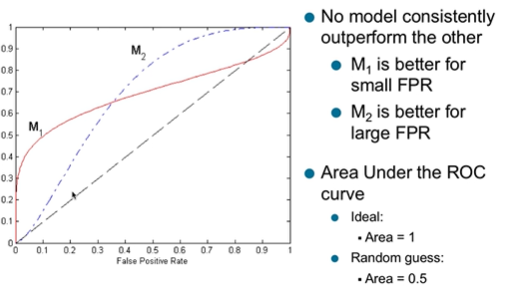

# Model Evaluation

## Metrics for Performance Evaluation

- Focus on the predictive capability of a model rather than the speed at which it takes to classify, build models, its scalability, etc.
- Confusion matrix
  - .
- Accuracy
  - 
- Cost Matrix
  - 
  - C(i | j) is the cost of misclassifying class j as class i
  - Example:
    - 
- Cost VS Accuracy
  - Cost is a linear function of accuracy and proportional
  - 
- Cost-Sensitive measures
  - 

## Methods for performance evaluation

- Performance can be hindered by other factors besides algorithm:
  - Class distribution
  - Cost of misclassification
  - Size of training and test sets
- Learning Curve
  - 
  - Learning curve shows how accuracy changes with varying sample size
  - Requires a sampling schedule for creating learning curve
  - Effect of small sample size:
    - Bias in the estimate
    - Variance of estimate
- Methods of estimation:
  - Holdout
    - Reserve 2/3 of training and 1/3 for testing
  - Random sampling
    - Repeated holdout
  - Cross validation
    - Partition data into k disjoint subsets
    - k-fold: train on k-1 partitions, test on the remaining one
    - Leave-one-out: k=n
  - Stratified sampling
    - Oversampling vs undersampling
  - Bootstrap
    - Sampling with replacement

## Methods for Model Comparison

- Receiver Operating Clartistic (ROC)
  - Made for signal detection theory to analyze noisy signals
    - Characterize the trade-off between positive hits and false alarms
  - Plot the TP (on y-axis) against FP (on the x-axis)
  - Performance of each classifier is represented as a point on the ROC curve
  - 
    - (FP,TP)
    - (0,0): declare everything to be negative class
    - (1,1): declare everything to be positive class
    - (0,1): ideal
    - Diagonal line:
      - Random guessing
      - Below diagonal line
        - Prediction is opposite of true class
  - Model comparison with ROC
    - 
