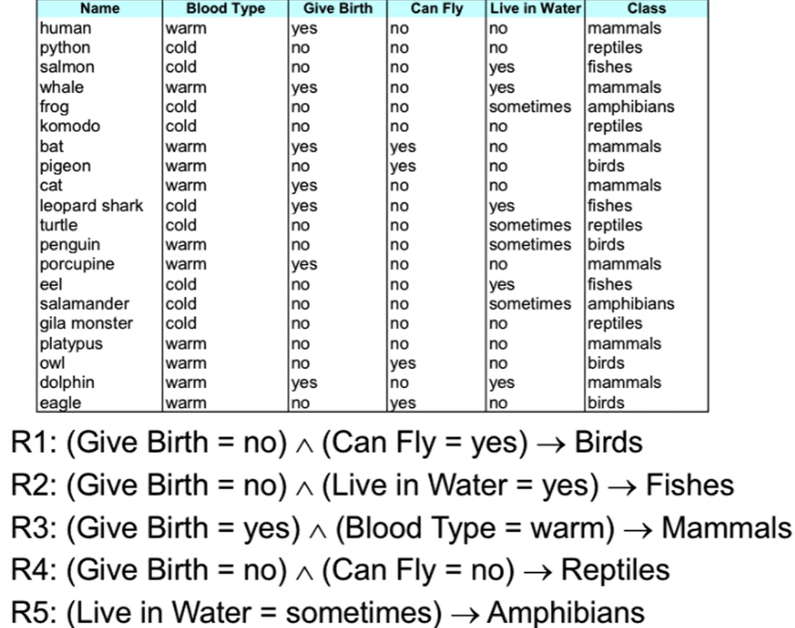
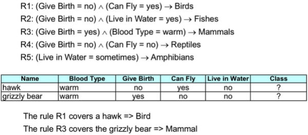
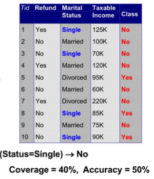
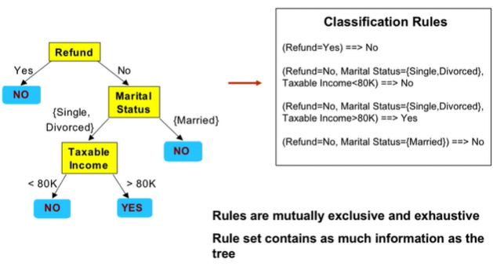
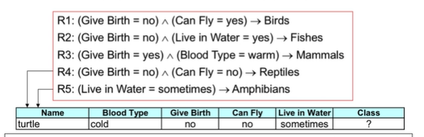
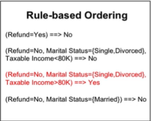
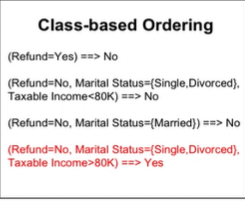

# Rule-based Classifier

- Classify records by using a collection of "if then" rules
- Rule: (Condition) -> y
  - Where:
    - Condition is a conjunctions of attributes
    - y is the class label
  - LHS is the antecedent or condition
  - RHS is the role consequence
  - Example:
    - 
- The Rule r covers an instance x if the attributes of the instance satisfy the condition of the rule
  - 
- Coverage of a rule
  - Fraction of records that satisfy the antecedent of a rule
- Accuracy of rule
  - Fraction of records that satisfy both the antecedent and consequent of a rule
- Coverage and accuracy example:
  -  
- Mutually exclusive rule
  - Classifier  contains mutually exclusive rules if the rules are independant of eachother
  - Every record is covered by at most one rule
- Exhaustive rules
  - Classifier has exhaustive coverate if it accounts for every possible combination of attribute values
  - Each records is covered by at least one rule

## How to get rules from a decision tree

- 
  - Rules can be simplified
    - Simply say (Status=Married) -> No
    - This makes rules no longer mutually exclusive
      - A record may trigger more than one rule
    - Solution:
      - Ordered Rule set
      - Unordered rule set - use voting schemes
    - Rules are no longer exhaustive
      - A record may not trigger any rules
      - Solution would be to use a default class

## Ordered rule sets

- Rules are ranked according to their proiroty
- When a test record is presented to the classifier:
  - It is assignened to a class label of the highest ranked rule it has triggered
  - If none are fired, it is asigned to a default class
- 
  - Turtle labeled reptile cause r4 > r5
- Rule-based ordering
  - Priority based on some sort of quality
  - 
- Class-based ordering
  - Rules tha tbleong to the same class appear together
  - 
