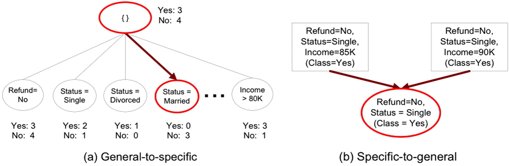

# Sequential Covering

1) Start from an empty rule
2) Grow a rule using the Learn-One-Rule function
3) Remove training records covered by the rule
4) Repeat steps 2/3 until stopping criterion are met

- 

## Rule Growing

- CN2 Algorithm
  - Start from empty conjunct: {}
  - Add conjuncts that minimize the entropy measure
  - Determine the rule consequently by taking majority class of instances covered by the rule.
- RIPPER Algorithm
  - Start from an empty rule: {} => class
  - Add conjuncts that maximize FOIL's information gain:
    - R0: {} => class (inital rule)
    - R1: {A} => class (rule after conjunct)
    - Gain(R0, R1) = t [log(p1/p1+n1)) - log(p0/(p0+n0))]
      - t: number of positive instances covered by both R0 and R1
      - pN: number of positive instances covered by RN
      - nN: number of negative instances covered by RN

## Instance Elimination

- We remove instances as otherwise, the next rule is identical to the previous rule
- We remove positive instances to prevent overestimating accuracy of rule
- Removing negative instances prevents understimating accuracy of rule

## Rule Evaluation

- Accuracy
  - nc/n
- Laplace
  - (nc + 1) / (n + k)
- M-estimate
  - (nc + kp) / (n + k)
- n: number of instances covered by rule
- nc: number of positive instances covered by rule
- k: number of classes
- p: prior probability

## Stopping Criterion

## Rule Pruning