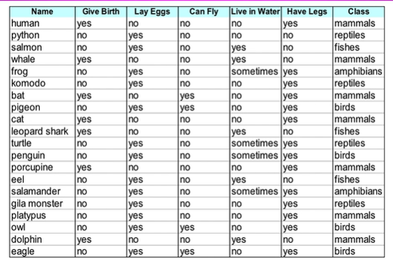
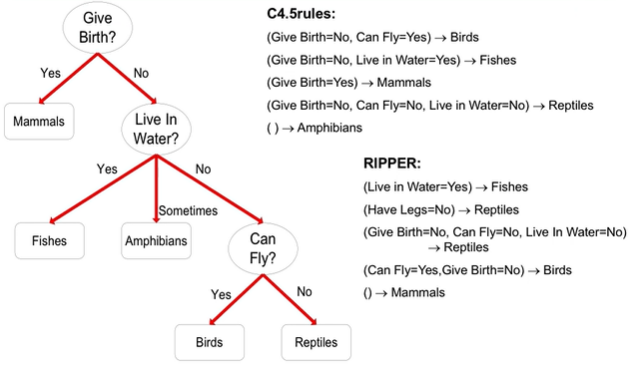

# How to build

## Direct method

- Extract rules directly from the data
- RIPPER algorithm:
  - For a 2 class problem, choose one of the classes as positive and the other as negative
    - Learn rules from positive class
    - Negative class will be the default class
  - For multi-class problem
    - Order the classes according to increasing class prevalence (fraction of instances that belong to the class)
    - Learn the rule set for the smallest class first, treat the rest as negative class
    - Repeat with next smallest class as positive class.
  - Growing a rule with RIPPER
  - Start from empty rule
  - Add conjuncts as long as they improve FOIL's information gain
  - Sto when rule starts covering negative examples
  - Prune the rule based on its performance on the validation set
    - prune using: v = (p - n)/(p + n)
    - p: number or positive examples covered by rule
    - n: number of negative examples covered by rule
  - Building a rule set
  - Use sequential covering algorithm
    - Finds the best rule that covers the current set of positive examples
    - Eliminate both positive and negative examples covered by the rule
  - Each time a rule is added to the rule set, compute the new description length
    - Stop adding new rules when the new description length is d bits longer than the smallest description length obtained so far.

## Indirect method

- Build the rule based system directly from a different classification model (neural nets, decision trees, etc.)
- C4.5 Algorithm
  - Ideally we want to simplify the given rules, this algorithm does that
  - Extract rules from an unpruned decision tree
  - For each rule, r: A -> y
    - Consider and alternative rule r': A' -> where A' is obtained by removing one of the conjuncts in A.
    - Compare the pessimistic error rate for r' against all r' instances
    - Consider the r' with the lowest error rate, and if it has a lower rate than the original rule, replace r with r'.
    - Repeat until no more improvement can be calculated
  - Instead of ordering rules, order subsets of rules (class ordering)
    - Each subset is a collection of rules with the same rule consequent (class)
    - Compute description length of each subset
      - Description length = L(error) + gL(model)
      - g is the parameter that takes into account the presence of redundant attributes in a rule set (default of 0.5)

## Comparison of RIPPER and C4.5

- Dataset
  - 
- Rules created
  - 
