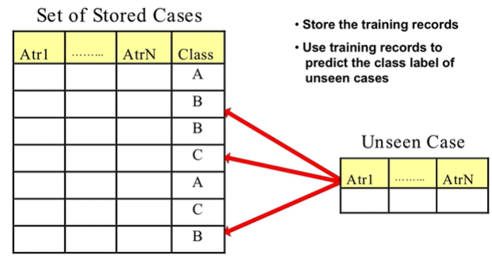
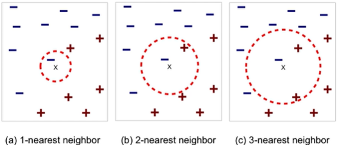
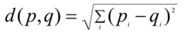
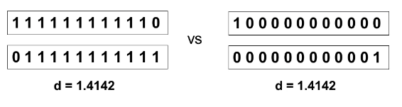

# Instance-Based Classifiers

- 
- We make predictions directly from the data itself.
- We use training records itself without much generaliation 
  - No decision trees, no rules, etc.
  - Use data as is to make a prediction

## Types

- Role-learner
  - Memorizes training data and performs classification only if attributes of record mat one of the train examples exactly

- Nearest neighbor
  - Does k "closest" points for performing classification
  - Requires 3 things:
    - The set of stored records
    - Distance Metric to compute distance between records
    - The value of k, the number of neighbors to retrieve
      - 
      - For every higher k value, radius increases
      - if k is too small,sensitive to noise and if its too large we'll be getting data that is too different from source
  - To classify an unknown record
    - Compute distance to other training records
      - Euclidean Distance:
    - Identify k nearest neighbors
    - Use class labels of nearest neighbors to determine the class label of unknown record
      - Weight the vote according to distance
  - If the dimensionality of the data is too high, counter-intuitive results occur
    - 
    - Assuming 1 is positive and 0 is negative
    - Solution is to normalize the vectors to a unit length
