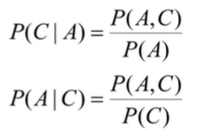
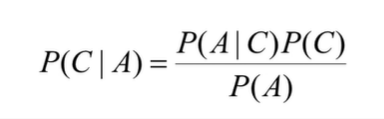
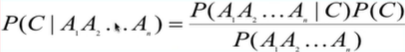
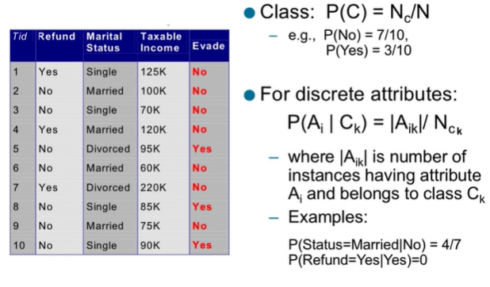
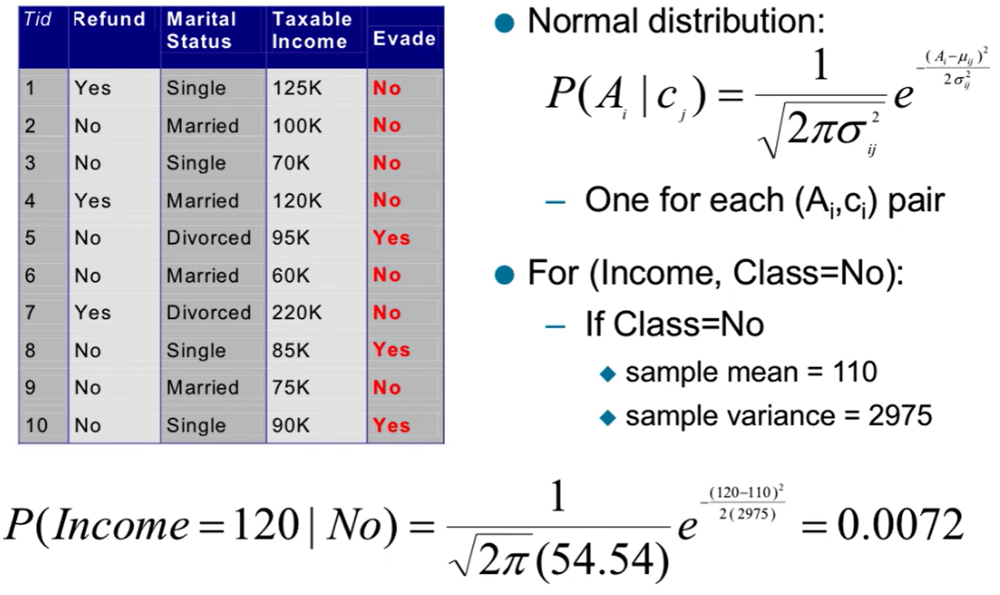

# Bayesian Classifier

- A probabilistic framework for solving classification problems
- Conditional probability:
  - 
- Bayes theorem
  - Probability of c given a
  - 

## Bayesian Classifiers

- Consider each attribute and class label as random variables
- Given a record with attributes (A1, A2, ... An)
  - Goal is to predict class C
  - P(C|A1, A2, ... An)

### Approach

- Compute the posterior probability P(C|A1, A2, ... An) for all values of c using the Bayes theorem
  - 
- Choose value of C that maximizes P(C|A1, A2, ... An)
- Equivalent to choosing value of C that maximizes P(A1, A2, ... An|C) \* P(C)

## Naive Bayes Classifier

- Assumes independence among attributes Ai when class is given:
  - P(A1, A2,... An|C) = P(A1|Cj) \* P(A2|Cj) \* ... P(An|Cj)
  - Can estimate P(Ai|Cj) for all Ai and Cj
  - New point is classified to Cj if P(Cj) \* all P(Aj|Cj) is maximal
    - \* all = pi as in the alternate summation formula

## How to Estimate

- Very easy for discrete variables
  - 
- For continuous:
  - Discretize the range into bins
    - One ordinal attribute per bin
    - Violates independence assumption however
  - Two way split: (A < v) or (A > v)
    - Choose only one of the two splits as new attribute
  - Probability density estimation:
    - Assume attribute follows a normal distribution
    - Use data to estimate parameters of distribution (mean, stdv)
    - Once probability  distribution is known, can use it to estimate the conditional probability P(Ai|c)
  - 
  