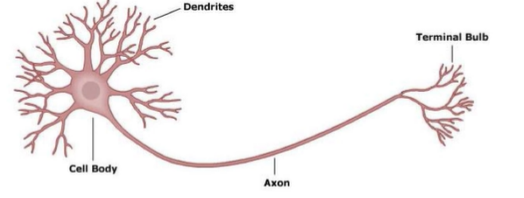
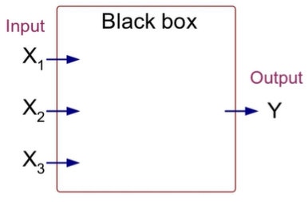
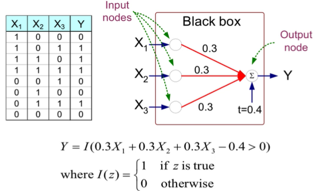
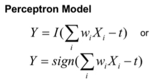
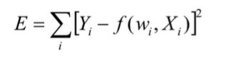

# Artificial Neural Networks (ANN)

- Form of learning inspired by biology (human brain and its neurons)
  - 
  - 
    - 'Blackbox' is full of other neurons and calculations
  - full example:
    - 
    - Model is an assembly of inter-connected nodes and weighted links
    - Output node sums up each of its input value according to the weights
      - 
    - Compare output node against some threshold

## General Structure of ANN

- Adding multiple hidden layers allows for more complex functions to be mapped
- Initialize the weights (w0, w1, ... wn)
- Adjust the weights in such a way that the output of ANN is consistent with class labels of training examples
  - Objective function
    - 
    - Function is just a linear transformation of input
  - Find the weights wi's that minimize the above function
    - Backpropagation algorithm
    - Gradient descent

