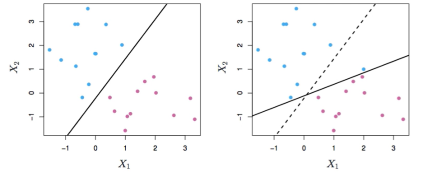

# Support Vector Machines

- A way to approach a two-class classification problem in a direct way.
- We try to find a plane that seperates the class into feature space (a hyperplane)
- If we cannot, we get two ways to manipulate data
  - Soften what we mean by 'separates'
  - Enrich and enlarge the feature space so that separation is possible

## What is a Hyperplane

- A hyperplane in p dimensions is a flat affine (involving or allowing for parallel relationships) subspace of dimension p - 1
- In general, the equation of a hyperplane has the form:
  - 
    - This gives us the euclidean distance between a point and plane
  - in p = 2 dimensions, a hyperplane is a line
    - 
  - iff B0 = 0, the hyperplane goes through the origin
  - B is normal vector
    - Points in a directional orthoganal to the surface of a hyperplane

## Separating hyperplanes

- if f(X) = B0 + B1X1 + ... Bp Xp, then F(X) > 0 for points on one side of the hyperplane, and F(X) < 0 on the other side
- we code the colored points  Yi = +1 for blue, and Yi = -1 to red
  - if Yi * f(Xi) > 0 for all i, f(X) = 0 defines a separating hyperplane

## Maximal Margin Classifier

- Among all separating hyperplanes, find the one that makes the biggest gap or margin between two classes
  - Maximize the euclidean distance
- 

## Non-separable Data

- Simply no way to draw a hyperplane for this

- Sometimes data is separable, but noisy. This can lead to the hyperplane moving dramatically with new data points.

## Support vector classifier (SVC)

- This can be used to solve the above issue!
- A SVC maximizes a 'soft' margin
- 
  - Allows data to be on the wrong side of the margin, *and* on the wrong side of the hyperplane
- This causes the hyperplane to be more robust
- 

## Nonlinearaties and Kernels

- Sometimes the linear boundary can fail, and thus we can:
  - Enlarge the space of features by including transformations (x1^2, x1^3)
    - Go from p-dimensional space to a M > p space
  - Fit a support-vector classifier in the enlarged space
  - This results in non-linear decision boundaries in the original space
    - quadratic conic sections

- Polynomials get difficult to compute very fast
- There is a better way to do this with a mathematical approach using 'kernels'
- Inner product between vectors
  - 
- Linear support vector classifier can be represented as the following instead of optimization problem
  - 
  - In most cases ai is 0
  - S is the *support set* of indices i such that ai > 0

## Kernel function

- if we can compute inner-products between observations we can fit a SV classifier
- Some special *kernel functions* can do this:
  - 
  - This computes the inner-products needed for d dimensional polynomials
  - Solution has the form: 
- This causes a nonlinear boundary
  - 
