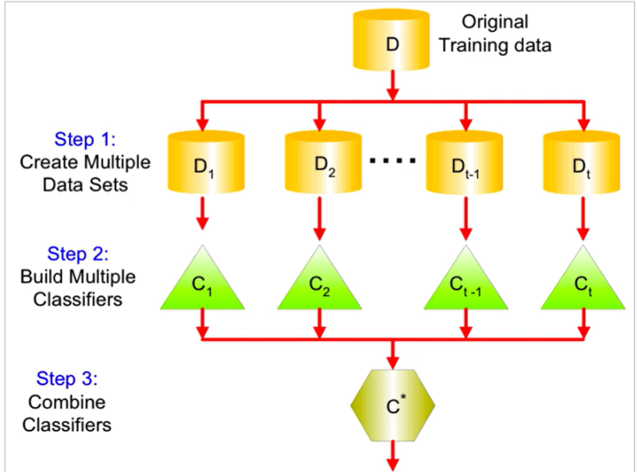
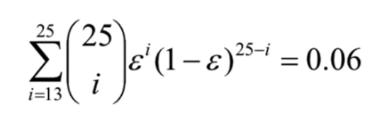
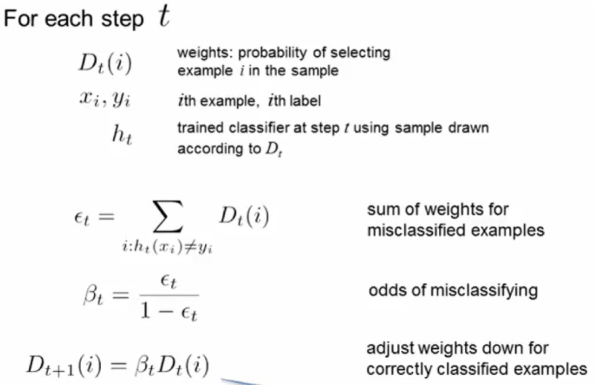

# Ensemble Methods

- Construct a set of classifiers from training data
- Build an aggregation of these to build the overall classifier
- 
  - This is the typical approach, aka the bootstrap approach
- Why does it work?
  - Suppose there are 25 base classifiers
  - Each classifier has error rate e = 0.35
  - assume classifiers are independent
  - Probability that the ensemble makes a wrong prediction
    - 

## Bagging

- Sampling with replacement
- Build classier on each bootstrap sample
- Each sample has probability of 1 - (1 - 1(1/n))^n of being selected

## Boosting

- An alternative procedure to adapt change or distribute training data by focusing more on previously misclassified records
  - Initially all N records are assigned equal weights
  - Unlike bagging, weights may change at the end of a boosting round
- 

## Random Forests

- Repeat k times:
  - Draw a bootstrap sample from the dataset
  - train a decision tree until the tree is maximum size
    - Choose next leaf node, select M attributes at random from the p available
    - Pick the best attribute split as usual
  - Measure out-of-bag error
    - Evaluate against th e samples that were not selected in the bootstrap
    - Provides measures of strength (inverse error rate), corelation between trees (increases the forest error rate) and variable importance
- Variable importance
  - Key idea: if you scramble the values of a variable and the accuracy of the tree doesnt change, then the variable isnt important
  - Measure the error increase
  - Random forests are more difficulty yo interpret than single trees; understanding variable importance helps
  - 