# Linear Regression

- Linear regression is a simple approach to supervised learning. It assumes the dependence of Y on X1, X2,... Xp is linear.
- True regression functions are never linear
- We are using a function that may be simpler than the actual relationship

## Model

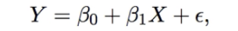

- B0 and B1 are two unknown constants that represent the intercept and slope
  - Known as coefficients or parameters
- e is the error term
- Given some estimates on B0 and B1 for the model coefficients, we predict using:
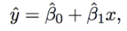
- We can estimate by least squares:
  - 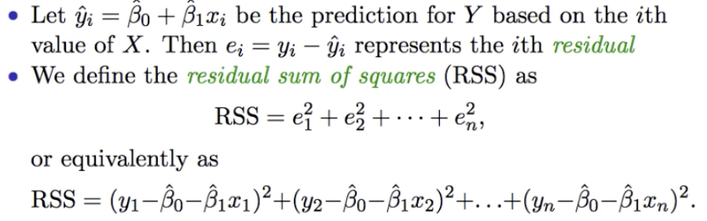
  - 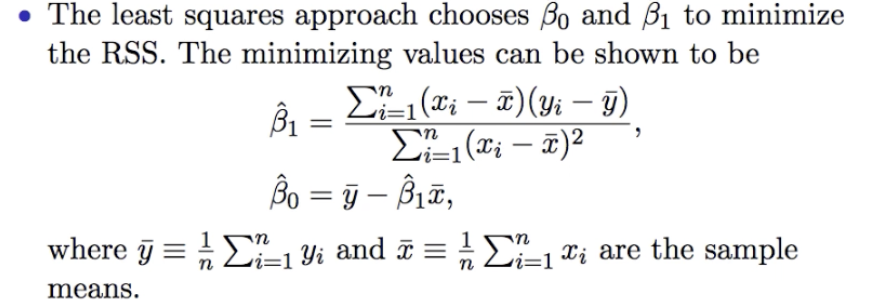
- Example:
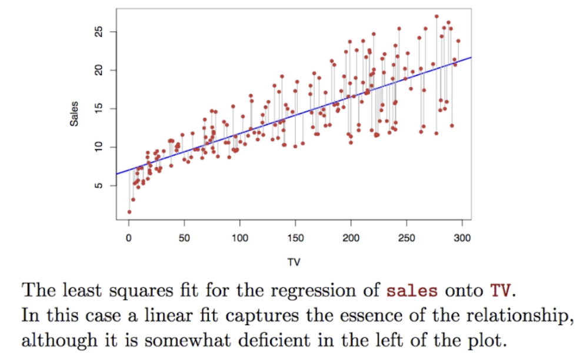

## Assessing Accuracy

- Calculating standard error of an estimator reflects how it varies under repeated sampling
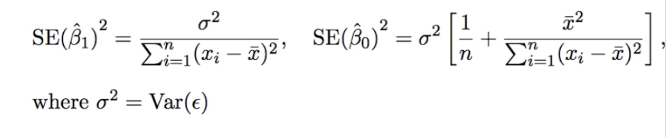
- These standard errors can be used to compute *confidence intervals*
  - A 95% confidence interval is defined as a range of values such that with 95% probability, the range will contain the true unknown value o the parameter. Has the form:
  - 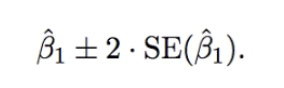
- Hypothesis testing
  - H0 (null hypothesis): there is no relationship between X and Y
    - Mathematically, H0: B1 = 0
    - Model reduces to Y = B0 + e so X is not associated with Y
    - To test, we compute the t-statistic:
      - 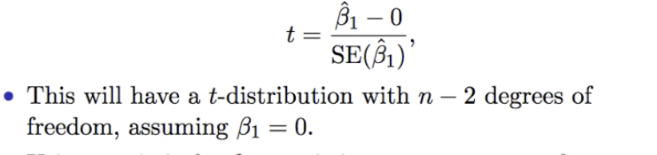
  - HA (alternative hypothesis): There is some relationship between X and Y
    - Mathematically, Ha: B1 =/= 0
  - The result of these tests on the example data:
  - 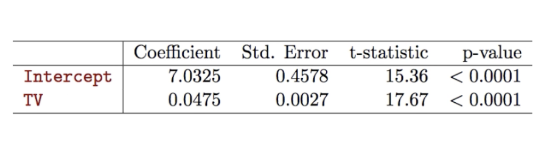

## Assessing Overall Accuracy of the Model

- Residual Standard Error
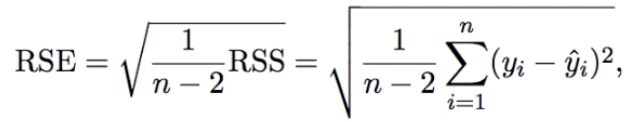
- Residual Sum-of-squares
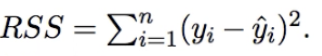
- R-squared
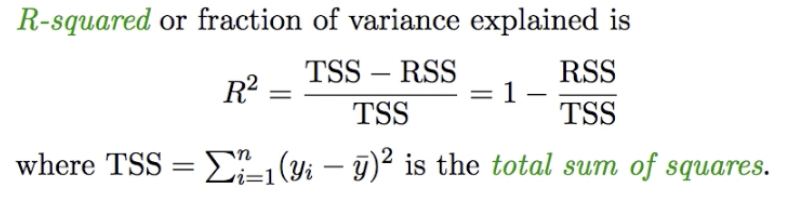
- It can be shown that in the simple linear regression setting, R^2 = r^2 where r is the correlation between X and Y

- Advertising data results:
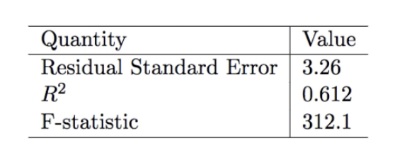
