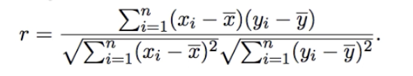
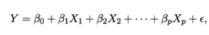
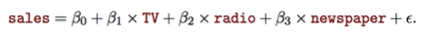
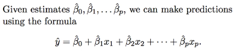
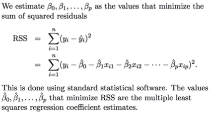
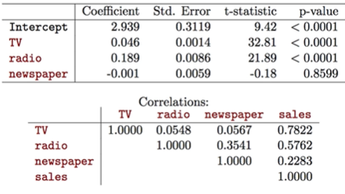
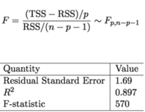

# Linear Regression

- Linear regression is a simple approach to supervised learning. It assumes the dependence of Y on X1, X2,... Xp is linear.
- True regression functions are never linear
- We are using a function that may be simpler than the actual relationship

## Model

- B0 and B1 are two unknown constants that represent the intercept and slope
  - Known as coefficients or parameters
- e is the error term
- Given some estimates on B0 and B1 for the model coefficients, we predict using:

- We can estimate by least squares:
  - 
  - 
- Example:

## Assessing Accuracy

- Calculating standard error of an estimator reflects how it varies under repeated sampling

- These standard errors can be used to compute *confidence intervals*
  - A 95% confidence interval is defined as a range of values such that with 95% probability, the range will contain the true unknown value o the parameter. Has the form:
  - 
- Hypothesis testing
  - H0 (null hypothesis): there is no relationship between X and Y
    - Mathematically, H0: B1 = 0
    - Model reduces to Y = B0 + e so X is not associated with Y
    - To test, we compute the t-statistic:
      - 
  - HA (alternative hypothesis): There is some relationship between X and Y
    - Mathematically, Ha: B1 =/= 0
  - The result of these tests on the example data:
  - 

## Assessing Overall Accuracy of the Model

- Residual Standard Error

- Residual Sum-of-squares

- R-squared

- It can be shown that in the simple linear regression setting, R^2 = r^2 where r is the correlation between X and Y

- Advertising data results:

## Multiple Linear Regression

- We interpret Bj as the average effect of Y on a one unit increase of Xj, holding all other predictions fixed
- With out advertising example, the model now becomes:

- The ideal senario is when the predictors are uncorrelated - a *balanced design*
  - Each coefficient can be estimated and tested separately
  - Interpretations such as "a unit change in Xj is associated with a Bj change in Y, while all other variables stay fixed" is possible
- Correlations amongst predictors cause problems:
  - The variance of all coefficients tends to increase, sometimes dramatically
  - Interpretations become hazardous - when Xj, everything else changes.
- Claims of causality should be avoided for observational data
  
### Estimation and Prediction for MLR

Results for advertising example:

## Hypothesis Tests

Is at least one predictor useful?

- We test with the F statistic

- Null hypothesis is that there are no significant values
- Expected value is 1
  - Larger value: Reject null hypothesis (At least one found)

Deciding which is the most important variable

- Use an approach called *all subsets* or *best subsets* regression:
  - Calculate the least squares fit for all possible subsets and choose based on criteria
  - Impossible to calculate ALL possible models in larger sets (2^p subsets)\
- Solutions:
  - Forward selection:
    - Begin with null model
    - Fit p simple linear regressions and add to the null model the variable that results in the lowest RSS
    - Add to the model the variable that results in the lowest RSS amongst all two-variable models
    - Continue until some stopping rule is satisfied
  - Backwards selection:
    - Start with all variables in the model
    - Remove the variable with the largest p-value - the least statistically significant.
    - the new (p - 1) variable model is fit, and the variable with the largest variable is removed
    - Continue until stopping rule is reached
