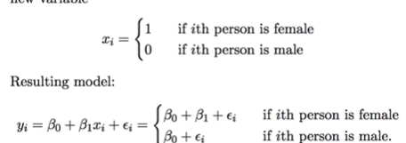
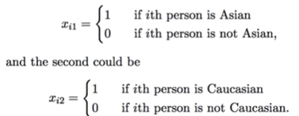

# Qualitative Predictors

- Some predictors are not quantitative but are qualitative, taking a discrete set of values,
- These are also called categorical predictors or factor variables
- Ex: Gender

- Ex: Race

## Interactions in Linear Models

Removing the additive assumption: interactinons and nonlinearity
- Interaction is the efect of one variable on another