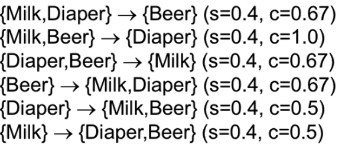

# Association Analysis

- Given a set of transactions, find rules that will predict the occurrence of an item based on the occurrences of other items

- {Diaper} -> {Beer}
- {Milk, Bread} -> {Eggs, Coke}
- {Beer, Bread} -> {Milk}
- Implication means co-occurrence, not causality
  
## Terms

- Item sets
  - The collection of one or more items
  - set of all items {Eggs, milk, bread}
  - K-itemset:
    - Itemset that contains k items
- Support count
  - Frequency of occurrence of an itemset

- Support
  - Fraction of transactions that contain an itemset
  - Ex: s({Milk, Bread, Diaper}) = 2/5
- Frequent Itemset
  - An itemset whose support is greater than or equal to a *minsup* threshold
  
## Association Rule

- An implication expression o the form X -> Y where X and Y are itemsets
  - Ex: {Milk, Diaper} -> {Bread}
- Rule Evaluation Metrics
  - Support (s)
    - Fraction of transactions that contain both X and Y
  - Confidence (c)
    - Measures how often items in Y appear in transactions that contain X

## Association rule mining task

- Given a set of transactions T, the goal of association rule mining is to find all rules having
  - support >= minsup threshold
  - confidence >= minconf threshold
- Brute-force approach:
  - List all possible association rules
  - compute the support and confidence for each rule
  - Prune rules that fail the minsup and minconf thresholds
  - This is computationally expensive
- Example of Rules:

  - Observations
    - All the above rules are binary partitions of the same itemset {Milk, Diaper, Beer}
    - Rules originating from the same itemset have identical support but can have different confidence
    - This implies that we may decouple the support and confidence requirements.

### Mining Association Rules

- Two-step approach:
  - Frequent itemset generation
    - Generate all itemsets whose support is => minsup
    - Still computationally expensive
      - Given d items, there are 2^d possible candidate itemsets
    - Can be brute forced:
      - Each itemset in a lattice is a candidate frequent itemset
      - count the support for each candidate by scanning the DB
      - Each each transaction against every candidate
      - Complexity ~ O(NMw) expensive since M = 2^d
        - N is transactions; M is candidates; NM is comparisons
  - Rule Generation
    - Generate high confidence rules from each frequent itemset, where each rule is a binary partitioning of a frequent itemset

## Strategies for simplification

### Reduce the number of candidates (M)

- Use pruning techniques to reduce from M = 2^d
- Apriori principle
  - If an itemset is frequent, then all subsets must also be frequent. The inverse is also true

- Method:
  - Let k=1
  - Generate frequent itemsets of length 1
  - Repeat until no new frequent itemsets are identified
    - generate length (k+1) candidate itemsets from length k frequent itemsets
    - Prune candidate itemsets containing subsets of length k that are infrequent
    - Count the support for each candidate by scanning the DB
    - Eliminate candidates that are infrequent, leaving only those that are frequent

### Reduce the number of transactions (N)

- Reduce size of N as the size of itemset increases

### Reduce the number of comparisons

- Use efficient data structures to store the candidates or transactions
- No need to match every candidate against every transition
- Candidate Counting:
  - Scan the database of transactions to determine the support for each candidate itemset
  - to reduce the number of comparisons, store the candidates in a hash structure
    - Instead ofg matching each transaction against every candidate, match it against candidates contained in the hashed buckets
  - Hash tree:

  - Hash function is mod(len)

## Computational Complexity

- Given d unique items:
  - Total number of itemsets = 2^d
  - Total number of possible association rules:

## Factors affecting complexity

- Choice of minimum support threshold
  - Lowering support threshold results in more frequent itemsets
  - this may increase number of candidates and max length of frequent intervals
- Dimensionality (number of items) of the dataset
  - More space is needed to store support count for each item
  - if number of frequent items also increases, both computation and I/O costs may also increase
- Size of database
  - Since Apriori makes multiple passes, run time of algorithm may increase with number of transactions
- Average transaction width
  - Transaction width increases with denser datasets
  - This may increase max length of frequent itemsets and traversals of hash tree
    - Number of subsets in a transaction increases with its width

## Maximal frequent itemset

