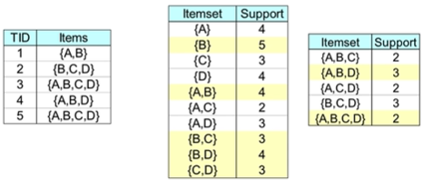
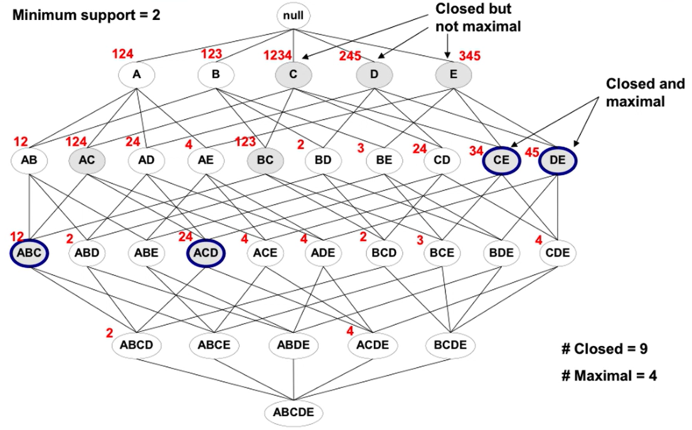
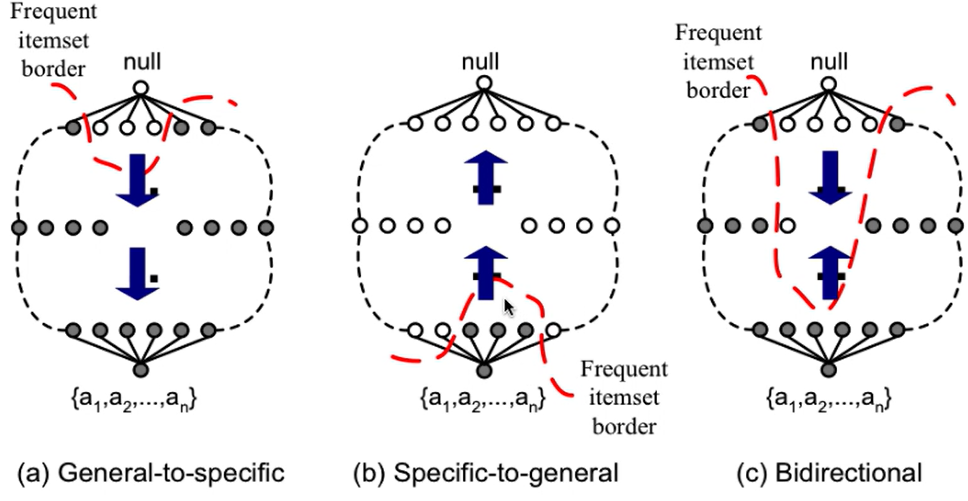
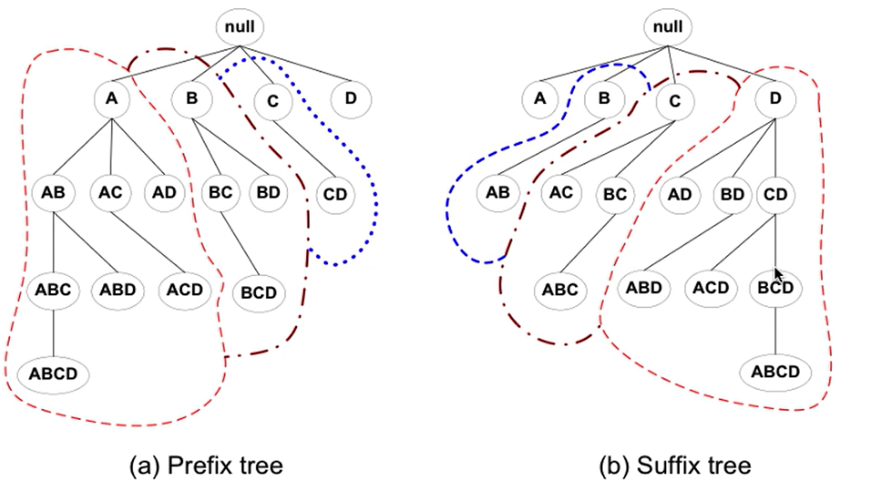
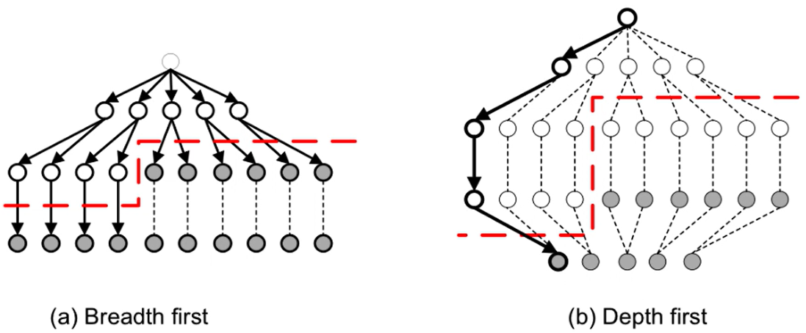

# Closed sets

- An itemset is closed if none of its immediate supersets have the same support as the itemset (highlighted in yellow)

- Maximal vs Closed

- Maximal is a subset of being closed
- Frequent itemsets > Closed Frequent Itemsets > Maximal Frequent Itemsets

## Traversal of Itemset Lattice

- General-to-specific vs Specific-to-general

- Equivalent Classes

- Breath vs depth
