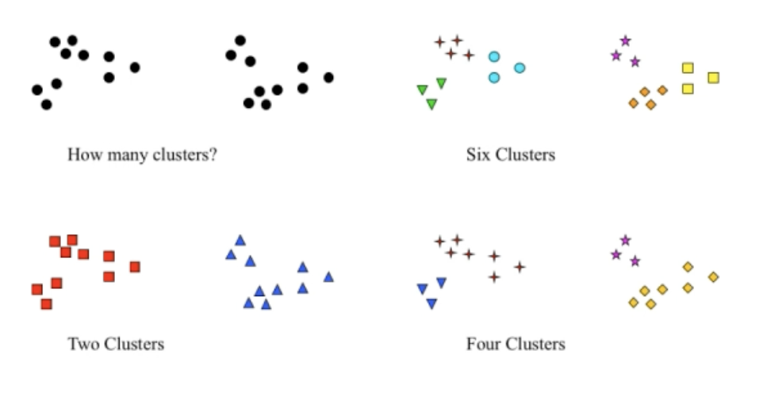
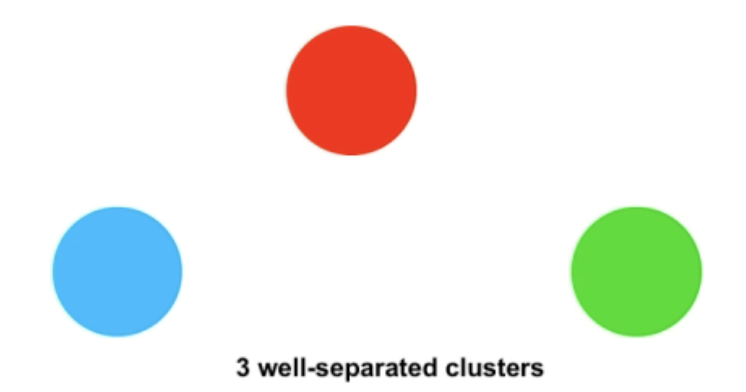
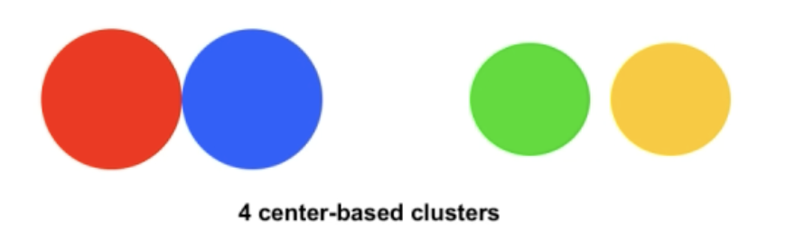
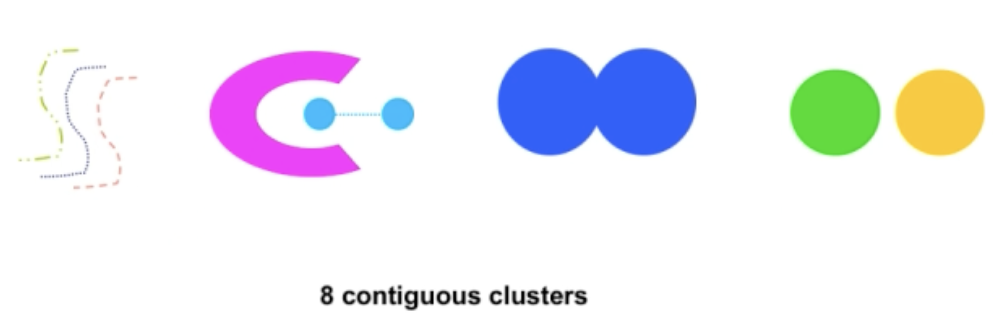
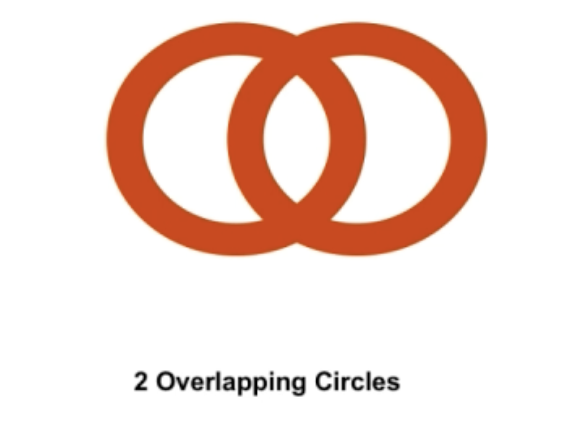
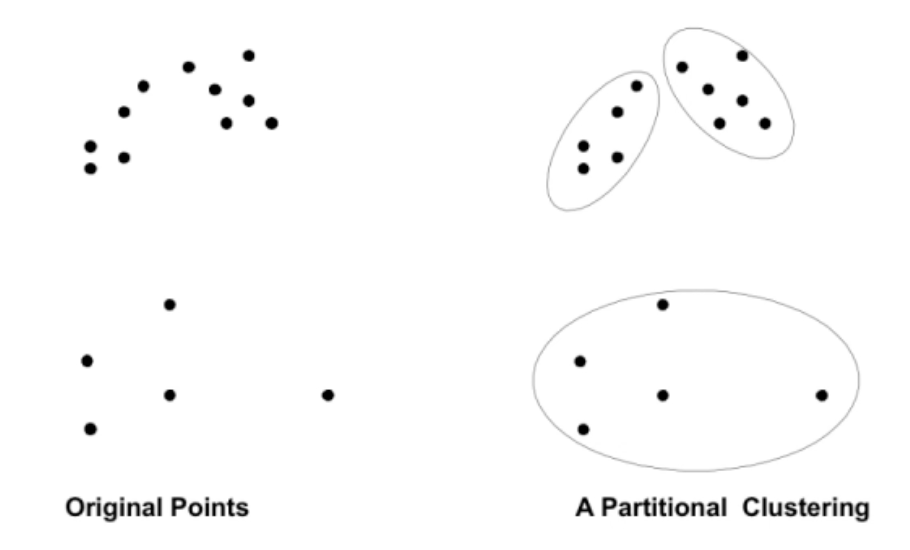
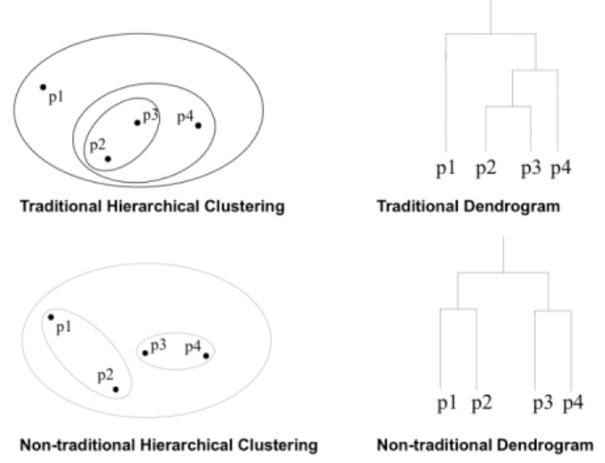

# Clustering Analysis

- Finding groups of objects such that the objects in a group will be similar (or related) to one another and different from (or unrelated to) the objects in other groups.
- No training set
- No target classes

## Applications

- Understanding
  - Group related documents for browsing, group genes and proteins that have similar functionality, or group stocks with similar price fluctuations
  - Ex: Amazon - group company separately from amazonian tribe
- Summarization
  - Reduce the size of large datasets

NOT Cluster analysis:

- Supervised classification
  - Have class label information
- Simple segmentation
  - Diving students into different registration groups alphabetically by last name
- Results of a query
  - Groupings are a result of an external specification
- Graph partitioning
  - Some mutual relevance and synergy, but areas are not identical.

## What is a cluster?

- In general, an inexact science

- The different outcomes here are all results of there being many different algorithms

### Types

- Well-separated
  - A cluster of points such that any point is closer to every other point in said cluster, to any point not in the cluster
  - 
- Center-based
  - A cluster of objects such that an object in a cluster is closer (more similar) to the "center" of a cluster, than to the center of any other cluster.
  - The center is often called the centroid
  - The average of all the points, aka the most "representative" point of a cluster is called the medoid
  - 
- Contiguity-based
  - Nearest neighbor or transitive
  - A cluster of points such that a point in a cluster is closer (or more similar) to one of more other points in the cluster than ny other point not in the cluster
  - 
- Density-based
  - A cluster is a dense region of points, which is separated by low-density regions, from other regions of high density
  - Used when the clusters are irregular or intertwined and when noise and outliers are present.
  - 
- Property or Conceptual
  - Shared property
  - Finds clusters that share some common property or represent a particular concept
  - 
- Described by an Objective function
  - Finds clusters that minimize or maximize an objective function
  - Enumerate all possible ways of dividing the points into clusters and evaluate the 'goodness' of each potential set of clusters by using the given objective function (NP hard)
  - Can have global or local objectives
    - Hierarchical clustering algorithms typically have local objectives
    - Partitional algorithms typically have global objectives
  - A variation of the global objective function approach is to it the data to a parameterized model
    - Parameters for the model are determined from the data
    - Mixture models assume that the data is a mixture of a number of statistical distributors

## Types of clustering

- A clustering is a set of clusters
- Important distinction between hierarchical and partition sets of clusters
- Partitional Clustering
  - a division data objects into non-overlapping subsets (clusters) such that each data object is in exactly one subset
  - 
- Hierarchical clustering
  - A set of nested clusters organized as a hierarchical tree
  - 
- Exclusive versus non-exclusive
  - In non-exclusive clustering, points may belong to multiple clusters
  - Can represent multiple classes or 'border' points
- Fuzzy versus non-fuzzy
  - In fuzzy clustering, a point belongs t every cluster with some weight between 0 and 1
  - Weights must sum to 1
  - Probabilistic clustering has similar characteristics
- Partial versus complete
  - In some cases, we only want to cluster some of hte data
- Heterogeneous verses homogeneous
  - Cluster of widely different sizes, shapes an densities
