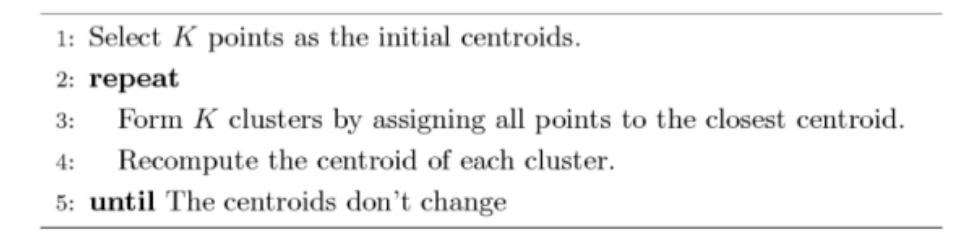
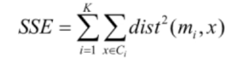
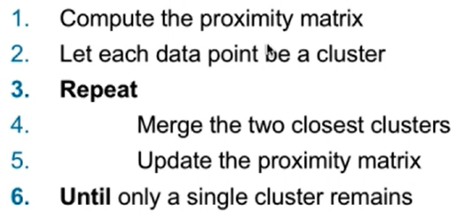
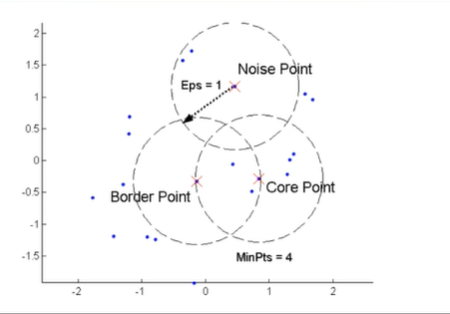
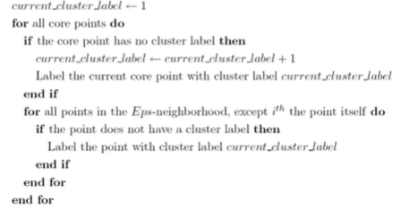
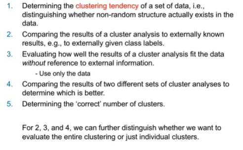
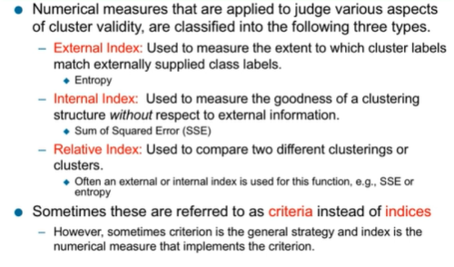

# Clustering Algorithms

## K-means and its variants

- Partitional clustering approach
- Each cluster is associated with a centroid
- Each point is assigned to the cluster with the closest centroid
- Number of clusters, K, must be specified
- The basic algorithm is very simple
- 

### General notes

- Initial centroids are often chosen randomly
  - Clusters produced vary from one run to another
  - Because of this, usually multiple runs are done and comparing each one with the following SSE formula.
- The centroid is typically the mean of the points in the cluster
- 'Closeness' is measured by Euclidean distance, cosine similarity, correlation, etc.
- K-means will not converge for common similarity measures mentioned above
- Most of the convergence happens in the first few iterations
  - Often the stopping condition is changed to 'until relatively few points change clusters'
- Complexity is O(n\*K\*i\*d)
  - n = number of points
  - K = number of clusters
  - i = number of iterations
  - d = number of attributes

### Evaluating its clusters

- Most common measure is Sum of Squared Error (SSE)
  - For each point, the error is the distance of the nearest cluster
  - To get SSE, we square these errors and sum them
  - 
    - X is a data point
    - Ci and mi are the representative point for cluster Ci
  - Given two clusters, we choose the one with the smaller SSE value

## Hierarchical clustering

- Produces a set of nested clusters organized as a hierarchical tree
- Can be visualized as a dendogram
  - 
- We do not need to assume any particular number of clusters
  - Any desired number of clusters can be obtained by 'cutting' the dendogram at the proper level
- They may correspond to meaningful taxonomies
  - ex: the biological sciences (species naming hierarchy)

### How to do it

- Agglomerative
  - Start with the points as individual clusters
  - At each step, merge the closest pair of clusters until only one cluster (or k) remain
  - 
- Divisive
  - Start with one, all-inclusive cluster
  - At each step, split a cluster until each cluster contains a point (or there are k clusters)
- Regardless of the type, typically a similarity/distance matrix is used

## Density-based clustering

DBSCAN - density based algorithm

- Density = number of points within a specified radius (Eps)
- A point is a core point if it has more than a specific number of points (minpts) within Eps
  - These are points that are at the interior or clusters
- A border point has fewer than MinPts within Eps but is in the neighborhood of ta core point
- A noise point is any point that is not a core point or a border point
- 
- To perform this algorithm:
  - Eliminate the noise points
  - 

## Cluster Validity

- For supervised classification we have a variety of measures to evaluate how good our model is 
  - Accuracy, precision, recall
- For cluster analysis the analogous question is how to evaluate the goodness of the resulting clusters
- We evaluate clusters to:
  - Avoid finding patterns in noise
  - Compare clustering algorithms
  - Compare two sets of clusters
  - Compare two clusters
- 
- 